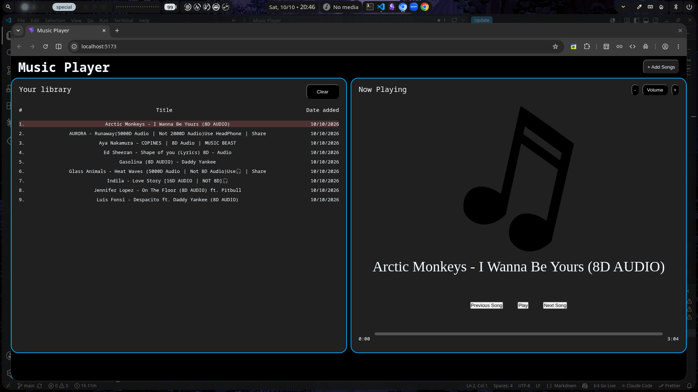

# Music Player

## Features
- *Add songs* --> put songs from ur system
- *clear songs* ---> u can also delete the songs which were saved temporarily in ur system
- *Volume Controls*  --> U can increase, decrease and set volume level as default.
- *Music Controls* --> U can toggle, go to next, previous music
- *Live Music play-bar* --> u can also see live song duration completed amongst the total duration and also you can drag that proress bar to skip particular part or jump to particular part of ur music
- *Dark Ui* -> we have simple Dark UI

## Tech Stack Used
- react -> component based UI
- CSS3 — Flexbox-based responsive layout
- HTML5 Audio API — Native browser audio playback
- Vercel — For deployment

**To test out this projcet just head to** : https://music-player-tau-cyan.vercel.app/

_______________________
This project was made for submitting in YSWS 